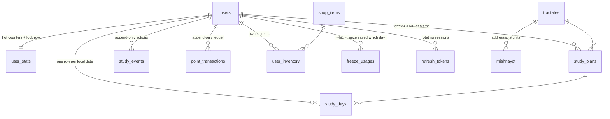

# Mishnah Tracker

**Open the app, read today's mishnah with its commentaries, mark it learned.**
That is the whole product. Everything below — streaks, points, penalties —
exists to get someone to open it, and is deliberately confined to one thin
strip at the top of the screen.

Each day shows the actual text of your mishnayot: vocalised Hebrew, with
Bartenura, the Rambam, Tosafot Yom Tov, Ikar Tosafot Yom Tov and Tiferet
Yisrael (Yachin and Boaz). Bartenura opens by default; the rest are one tap
away. Nikud toggles off for anyone who reads without it. The whole corpus ships
with the app — 4,192 mishnayot and their commentaries, read from disk, never
fetched at request time.

You learn either **seven days a week or five** (Sunday to Thursday). That is
the only calendar rule in the app: on a five-day week Friday and Shabbat carry
no quota, no penalty, and hold the streak steady.

FastAPI + SQLAlchemy 2.0. Self-contained project — no relation to anything else
on the Desktop.

## Run it

```bash
python -m venv .venv
.venv/Scripts/python.exe -m pip install -r requirements.txt
.venv/Scripts/python.exe -m uvicorn app.main:app --reload --port 8010
```

Open <http://localhost:8010> for the Hebrew UI, or `/docs` for the API. First
boot creates `mishnah.db` (SQLite) and seeds 63 tractates / 4,192 mishnayot.
Nothing else to install.

The dev bar at the bottom of the UI travels through time — a 4-day multiplier
and a missed-day penalty are otherwise only observable by waiting a week. It is
gated behind `dev_mode` and 404s when that is off.

**SQLite is for development only.** It has no row locks, so the concurrency
guarantees in §7 are unenforced there. Point `DATABASE_URL` at PostgreSQL for
anything real.

---

## Deploying

### What the host has to provide

| Requirement | Where it comes from |
|---|---|
| A long-lived Python 3.12+ ASGI process | the whole backend; `uvicorn app.main:app` |
| PostgreSQL with real transactions | `ledger.lock_stats` takes `SELECT … FOR UPDATE`; it is the only thing preventing two concurrent requests from both advancing the same streak |
| A connection pool held between requests | `db/session.py` — `pool_size=10, max_overflow=20` |
| ~11 MB in the image | `app/data/texts/` — the corpus travels with the code |
| Outbound HTTPS | Google for token exchange and JWKS. Nothing else. |
| Server-side secrets | the OAuth client secret and `JWT_SECRET` must never reach the browser |
| Ability to set cookies on a redirect | the Google callback sets an HttpOnly refresh cookie, then redirects |
| HTTPS on a stable domain | `Secure` cookies, and Google validates the exact redirect URI |
| ~512 MB RAM | FastAPI + SQLAlchemy, plus one tractate's text held in an LRU |

No persistent disk is needed — all mutable state is in Postgres, and the texts
are read-only files baked into the image.

### Why not Netlify

Netlify runs a static CDN plus short-lived serverless functions. Three things
rule it out, the first on its own:

1. **Python is not a Netlify Functions runtime.** The official configuration
   reference documents exactly three: TypeScript, JavaScript and Go. (Blog
   posts claiming a 2026 Python runtime are confusing `PYTHON_VERSION`, which
   selects Python for *build scripts*, with a function runtime.) This backend
   is Python with a compiled `psycopg` driver.
2. **Netlify has no database.** You would be renting Postgres elsewhere
   anyway, at which point the only thing Netlify contributes is the part this
   app does not need.
3. **Pooled connections and row locks assume a process that persists.**
   `pool_size=10` is meaningless when every request is a fresh instance, and
   serverless Postgres access needs an external pooler to avoid exhausting
   connections. The same goes for the text LRU: a learner reads one tractate
   for weeks, and a fresh instance per request re-parses it every time.

Netlify remains the right host for a static site. It is simply a different
kind of thing from this.

### There is no cron job

Worth stating up front, because it removes a whole component. `settle_user`
runs on every read, so a user who disappears for three weeks is settled
correctly the moment they open the app — verified: 21 days away with no
scheduler at all, one read, all 22 days resolved (15 missed, 6 rest days,
streak reset).

A scheduled sweep only earns its place when something must be correct *without*
the user showing up: a leaderboard showing other people's streaks, or a "your
streak breaks in 3 hours" notification. Neither exists yet. When one does, set
`RUN_SCHEDULER=true` — `app/workers/scheduler.py` runs the same worker hourly
inside the web process, so it still costs nothing extra.

### Where

| | Cost for this app | Cold starts | Postgres |
|---|---|---|---|
| **Railway** | ~$5/mo, usage-based | none | one click, managed |
| **Render** free | $0 | **sleeps after 15 min** | free tier, not for production |
| **Render** starter | ~$7 service + database | none | managed, predictable |
| **Fly.io** | ~$2–5/mo | none | you run and back it up yourself |

**Railway** is the recommendation for a daily-use personal app: cheapest of the
always-on options, one-click Postgres, and it builds straight from the
`Dockerfile`.

Render's free tier is the tempting option and the wrong one *for this app
specifically*. A study tracker is opened once a day, first thing — exactly the
access pattern that lands on a sleeping service every single time, and a
~50-second wait before you can read the day's mishnah is how a daily habit
dies. Render's paid tier is fine and more predictable than Railway; it just
costs more.

Fly.io is cheapest at scale but hands you an unmanaged Postgres, which means
backups are your problem. Not worth it here.

### Steps

1. **Google credentials** *(optional)* — in the [Google Cloud Console](https://console.cloud.google.com/apis/credentials),
   create an OAuth 2.0 Client ID (*Web application*) and add
   `https://YOUR-DOMAIN/api/v1/auth/google/callback` as an authorised redirect
   URI. Optional because email + password needs no configuration and is always
   available; without either, `DEV_MODE` being off in production means nobody
   can sign in at all.
2. **Push to GitHub.**
3. **Deploy** — Railway: New Project → Deploy from GitHub, add a Postgres
   plugin. Render: New → Blueprint (reads `render.yaml`).
4. **Set four variables** — `PUBLIC_BASE_URL`, `GOOGLE_CLIENT_ID`,
   `GOOGLE_CLIENT_SECRET`, `GOOGLE_REDIRECT_URI`. Generate `JWT_SECRET`
   (32+ random bytes) if the host does not. `DATABASE_URL` comes from the
   database.

The container runs `alembic upgrade head`, seeds the 63 tractates, then serves.
All three steps are idempotent, so redeploys are safe.

### What stops a bad deploy

`app/core/preflight.py` runs at startup and **refuses to boot** if:

- `DEV_MODE` is on with a non-localhost `PUBLIC_BASE_URL` — `/dev/login` mints
  a session for any email address and `/dev/time` moves the clock for every
  user, so this would be a full account takeover
- `JWT_SECRET` is still the built-in default — anyone could forge an access
  token for any account
- `COOKIE_SECURE` is false on a public host

and warns about SQLite in production, a missing `GOOGLE_CLIENT_ID`, or a
redirect URI that does not sit under `PUBLIC_BASE_URL`.

### Sessions

The refresh token lives in an HttpOnly, Secure, SameSite=Lax cookie, so page
script cannot read it and an XSS bug cannot walk off with a 30-day session. The
access token is short-lived and held in memory. Refresh tokens are single-use:
replaying a consumed one revokes the whole chain.

---

## 1. Screens

Four tabs, because the app does four distinct things:

- **היום** — today's mishnayot with their commentaries, and one button that
  says exactly what it does (`סיימתי לקרוא 3 משניות · +10 נק׳`). A hint line
  above states the task in words; when the day is done it says so instead.
- **עיון** — free navigation: chapter and mishnah pickers in Hebrew numerals,
  prev/next arrows that disable at the ends. Reading here is explicitly *not*
  logged, and the screen says so — otherwise browsing would silently feel like
  it should count.
- **הש״ס** — all 63 tractates grouped by seder with a progress bar each.
  Progress is the furthest cursor across *all* plans for that tractate, so a
  tractate abandoned half-way still shows what was learned.
- **הגדרות** — change the daily goal or the week mode, jump to any
  chapter:mishnah, switch tractate, or sign out. Each destructive action
  confirms first and states the consequence.

Onboarding asks for the week mode alongside the tractate and the daily goal —
it belongs with the other "what am I signing up for" choices, and it is set
once. Sign-in never writes it, so coming back to the app cannot quietly move
someone back to seven days a week.

A goal change applies to today when the day is still open, and never to a day
already resolved — re-scoring a finished day would hand out or revoke a streak
someone already earned.

---

## 2. The text layer (`services/texts.py`)

The part people come for. Downloaded from Sefaria **once**, by
`scripts/fetch_texts.py`, into one gzipped JSON file per tractate under
`app/data/texts/` — 63 files, ~11 MB, committed. At request time the app opens
a file and reads a dict. There is no network call, no cache table, and nothing
to warm.

| Commentary | Sefaria index | Edition shipped |
|---|---|---|
| ברטנורא | `Bartenura on {book}` | On Your Way |
| פירוש הרמב״ם | `Rambam on …` | Vilna |
| עיקר תוספות יום טוב | `Ikar Tosafot Yom Tov on …` | On Your Way |
| תוספות יום טוב | `Tosafot Yom Tov on …` | Romm, Vilna 1913 |
| תפארת ישראל – יכין / בועז | `Yachin on …` / `Boaz on …` | Romm, Vilna 1913 |

Every one of them Public Domain — see below, because that took deciding.

**Shipping the corpus beats caching it.** The texts are centuries old and never
change, so the only thing a live API gives you is a dependency that fails on a
train, during a rate-limit, or on the morning Sefaria is down — precisely when
someone is trying to keep a streak. Forty megabytes of Hebrew gzips to eleven,
which is smaller than most of what a web app ships without thinking about it.
A tractate is parsed once per process and held in an 8-slot LRU, because a
learner reads the same one for weeks.

**Commentary is anchored through Sefaria's link graph, not by position.** This
is the subtle one. A commentary numbers its own segments, and that numbering is
not the mishnah's: `Yachin on Mishnah Berakhot 1:13` is the *thirteenth comment
in chapter 1*, which lands on mishnah 2. Reading `Yachin … 1:3` as "the comment
on mishnah 3" returns real, well-formed, **wrong** text — no error, nothing to
notice. The fetch script asks `/api/links` for each chapter and uses the
`anchorRef → ref` mapping instead, then joins every segment anchored to a given
mishnah in ref order.

**The primary edition is not the freest one, and that is a business decision
hiding in a data-fetching script.** Sefaria serves Bartenura and Ikar Tosafot
Yom Tov from a CC-BY-NC edition by default — with a Public Domain edition of
the same commentary sitting right behind it in `available_versions`. Taking the
default imposed "non-commercial use only" on the entire corpus, which quietly
rules out ever charging for the service, selling it to a school, or putting an
advert beside it. Nothing about that shows up as a bug; it would surface years
later, to whoever tried.

So editions are chosen by licence (`MAX_LICENCE_RANK`), freest first, and
restricted ones are skipped even at the cost of a gap. The default admits
Public Domain, CC0 and CC-BY, and rejects both `-nc` (no commercial use) and
`-sa` (share-alike, which is viral into whatever it is combined with). The
whole price was one mishnah: Yachin on Chullin 7:2, which only the CC-BY-SA
Wikisource edition covers. `tests/test_texts.py` asserts the property across
all 63 files so a careless re-fetch cannot quietly give it back.

**No single edition is complete**, so editions are layered. Mishnah Bikkurim's
primary version is the one printed with the Gemara and holds only chapter 4;
Torat Emet holds chapters 1–3 and stops. Taking the primary alone leaves 34 of
39 mishnayot blank. The script fills gaps from further Hebrew editions and
records every version it used in the file's `sources`. The largest books
(Tosafot Yom Tov on Chullin) make Sefaria's gateway time out, so a book that
fails whole is re-fetched a chapter at a time.

**A missing commentary is normal.** Not every mishnah has an Ikar Tosafot Yom
Tov; Berakhot 1:1 has six commentaries and 1:2 has five. Misses are skipped
silently rather than surfaced as errors.

**Refs are built from Sefaria's spelling, not ours.** `tractates.sefaria_title`
stores the title that actually resolved during seeding, because Sefaria files
Uktzin as *Oktzin* — deriving refs from our own `name_en` would 404 every text
in that tractate.

Markup is sanitised **at download time** to an inline allow-list, so nothing
unsanitised is ever stored; the client then builds the node tree from the same
allow-list rather than assigning `innerHTML`. The bold lemma is kept
deliberately and then *highlighted*: the dibur hamatchil a commentary opens
with tells you which words of the mishnah it is on, and tinting it is what
turns a wall of justified Hebrew into something you can navigate.

To re-download (a Sefaria correction, or a new commentary in the list):

```bash
.venv/Scripts/python.exe scripts/fetch_texts.py            # all 63, ~30 min
.venv/Scripts/python.exe scripts/fetch_texts.py berakhot   # just one
```

Hebrew numerals are computed client-side for references — פרק א׳, משנה ב׳, and
ט״ו / ט״ז rather than יה / יו.

---

## 3. The three problems worth designing around

Most of this app is CRUD. Three things are not, and the whole structure follows
from them.

**A "day" is not a timestamp range.** It is a human unit that depends on the
user's timezone and on a 03:00 rollover — people learn at 01:00 and expect it
to count for the day that just ended. Every day boundary goes through
`UserClock`; no other module calls `.date()` on a timestamp.

**Nobody is online when the penalty should fire.** A streak breaks at midnight
in a timezone the server isn't in, for a user who isn't connected. So the
system cannot be event-driven off user actions. Instead there is one
**idempotent settlement function** that walks a user's closed days and finalises
each exactly once — called on every read *and* from an hourly cron. Neither
needs to know about the other.

**A rest day inverts the penalty logic.** On a five-day week, *not* using the
app on Friday and Shabbat is the expected behaviour and must cost nothing. That
cannot be a UI state — it has to be a rule inside the settlement engine, or the
cron will happily punish those users at 03:00 Saturday.

---

## 4. Schema



### The tables that carry the logic

| Table | Role | Why it exists separately |
|---|---|---|
| `study_days` | One row per user per local date, with a `status` | The **ledger of judgements**. "Was Tuesday missed?" is a stored fact, not a recomputation. Unique `(user_id, local_date)` is what makes settlement idempotent. |
| `study_events` | Append-only log of the user actually logging study | A day is a *judgement*; an event is an *action*. Two logs of 1 mishnah = two events, one day row. Carries the client `Idempotency-Key`. |
| `point_transactions` | Append-only, signed, with a unique `idempotency_key` | The truth about points. `user_stats.total_points` is a materialised balance you can always rebuild with `SUM(amount)`. |
| `user_stats` | Balance, streak, `last_settled_date` | Also the **lock row**: every mutating path takes `SELECT … FOR UPDATE` on it first, which serialises all scoring for that user without a distributed lock. |

The texts are not a table. They are files under `app/data/texts/`.

### Day statuses

| Status | Streak effect | Points | Meaning |
|---|---|---|---|
| `PENDING` | — | — | Open; today, or a day not yet settled |
| `COMPLETED` | +1 | award | Goal met |
| `MISSED` | → 0 | penalty | Goal not met, no protection |
| `FROZEN_ITEM` | unchanged | 0 | A Streak Freeze absorbed it |
| `REST_DAY` | unchanged | 0 | Off by the week mode — neutral, **not** punished |
| `EXEMPT` | unchanged | 0 | Before signup / paused plan |

The distinction between "unchanged" and "→ 0" is the whole of the week-mode
feature. A freeze and a rest day both *hold* the streak; neither *advances* it.
A freeze protects, it does not substitute for study.

### Progress as a single integer

`mishnayot.ordinal` is a 1-based running index within a tractate, so
`study_plans.current_ordinal` answers "where am I" with an integer compare
instead of `(chapter, number)` tuple logic. Advancing 2 mishnayot is `+= 2`,
even across a chapter boundary.

---

## 5. Scoring (`services/scoring.py` — pure, no I/O)

```
points = base_points × multiplier(streak_after_this_day)
```

| Streak | Multiplier | Points/day |
|---|---|---|
| 1–3 | 1.0× | 10 |
| 4–9 | 1.5× | **15** |
| 10–29 | 2.0× | 20 |
| 30+ | 2.5× | 25 |

Tiers are data, not an `if` chain — adding a 100-day tier is a config edit.
`streak_after` means the streak *including* today, so completing your 4th
consecutive day pays 15. Verified in `tests/test_rules.py`:
`[10, 10, 10, 15, 15]`.

**Penalty:** −15 and streak → 0, *clamped so the balance never goes below zero*.
A user returning after a month should find a discouraging zero, not a debt that
locks them out of the shop. The ledger records the amount actually applied.

**Streak Freeze:** 120 points, max 3 held. Consumed automatically by the
settlement engine when a day would otherwise be `MISSED` — no pre-arming, no
"you forgot to activate it" support tickets.

---

## 6. The study week

One setting, two values, and it is the only calendar rule in the app:

| Mode | Study days | Friday & Shabbat |
|---|---|---|
| `seven_days` *(default)* | every day | ordinary days: full quota, ordinary penalty |
| `five_days` | Sunday–Thursday | `required_units = 0`, never punished, streak held |

`User.study_week` lives on the user rather than the plan, because it describes
a person's rhythm — switching tractate should not quietly put someone back to
seven days a week.

### Nothing is carried over

A rest day's quota is not moved to a neighbouring day. Five days a week means
five days' worth of mishnayot, which is the entire reason someone picks it; a
"catch-up" Thursday of double length would hand them back the burden they just
opted out of. The completion estimate absorbs the difference instead, which is
why it is a calendar walk (§10).

### Three ways through a weekend on a five-day week

| What the user does | Friday | Shabbat | Streak |
|---|---|---|---|
| Does not open the app | `REST_DAY` | `REST_DAY` | **held** |
| Reads Friday's portion anyway | `COMPLETED` | `REST_DAY` | **+1** |
| Reads both | `COMPLETED` | `COMPLETED` | **+2** |

A rest day requires nothing, but it is not *closed*: the portion still renders,
the button still works, and finishing the daily goal credits the day like any
other. Being told "today does not count" is a worse experience than being given
the day off, and it is one branch in `_decide` either way.

### Setting and changing the mode

Chosen at onboarding, changed in הגדרות; both go through `PUT
/me/preferences`, which re-classifies **today's open row** and re-projects the
completion estimate immediately rather than waiting for the next settlement.
Days already resolved keep the judgement they were given — re-scoring a
finished day is how you accidentally revoke a streak someone earned.

Nothing on the sign-in path writes `study_week`. It is the kind of field a
login handler acquires a default for by accident, and the symptom — a learner's
track silently reverting on their next visit — looks like a data-loss bug
rather than a login bug.

---

## 7. Settlement — the one function that moves the economy

`services/settlement.py :: settle_user(session, user, now)`

```
lock user_stats FOR UPDATE
cursor = last_settled_date + 1
while cursor < today:                 # today is never finalised — it is still winnable
    day = get_or_create(cursor)
    decide → CREDIT | MISS | FREEZE | REST | EXEMPT | CARRY
    apply, advance last_settled_date
ensure today's row exists
```

Two properties make this safe to call from anywhere:

1. **Idempotent.** Terminal statuses are never recomputed, and every award
   carries a deterministic `idempotency_key` (`daily:<user>:<date>`). Re-running
   changes nothing. `ON CONFLICT DO NOTHING` returning `None` means "already
   applied" — the balance must not move, and the streak must not advance.
2. **Ordered.** Days resolve chronologically because the multiplier depends on
   the streak, which depends on yesterday.

Every closed day is now decidable the moment it closes, which is what removed
the old `DEFER` state: when rest days were defined by sunset and a retroactive
report, a Friday could not be judged until the following Monday, and the
settlement watermark had to be able to stay behind an unresolved day. A rest
day is a property of the date itself, so that machinery is gone.

**Called on every read**, so a user opening the app after two weeks sees correct
state immediately. The **hourly** cron (`workers/nightly.py` — hourly despite
the name, because rollovers are per-timezone) exists only so lapsed users still
get penalties recorded and leaderboards aren't stale.

### Concurrency

Everything serialises behind the `user_stats` row lock, taken first and in the
same order by every mutating path. Two simultaneous "log study" requests cannot
both read `streak=3` and both write `streak=4`. Belt-and-braces on top:
`uq_user_day`, `uq_freeze_per_day`, and the unique `idempotency_key` on both the
ledger and `study_events`.

---

## 8. Auth

Two ways in. Both end at the same place: a short-lived access JWT (15 min) held
in memory, plus a rotating refresh token stored **hashed** — a database leak
must not hand out live sessions. Reusing a consumed refresh token is the
classic stolen-token signal, so it revokes the whole chain for that user.

### Email + password

`POST /auth/register` and `POST /auth/login`. Passwords are hashed with
**scrypt from the standard library** rather than bcrypt or argon2 from a
compiled wheel: it is memory-hard, it needs no build toolchain, and the cost
parameters travel inside the digest (`scrypt$n$r$p$salt$hash`) so they can be
raised later without invalidating anyone's password.

Two details that are easy to get wrong and are pinned by tests:

- **A wrong password and an unknown address return the identical response.**
  Distinguishing them turns the login form into a directory of who has an
  account here. `verify_password` also hashes against a dummy digest when
  there is no account, so the two paths take the same time — returning early
  would leak through the clock what the response body does not say.
- **Email is unique among password accounts only**, via a partial index. There
  the address *is* the identity. Constraining it globally would import the
  Workspace email-reuse problem into the Google path, which is the whole reason
  `google_sub` is the join key there. Registration additionally refuses an
  address any account already holds, so signing in with Google and then
  registering the same address cannot silently fork someone's streak into two.

n=2**14 is deliberate: OpenSSL refuses scrypt over 32 MB by default, so n=2**15
with r=8 does not run slower, it raises "memory limit exceeded".

### Google

**Authorization Code + PKCE**. The code is exchanged server-side so the client
secret never reaches the browser, and the returned `id_token` is *verified*
against Google's JWKS (`aud`, `iss`, `exp`) rather than trusted — an attacker
can POST any JWT they like at our endpoint.

Google users are keyed on `sub`, **never on email**. Workspace emails get
reassigned; matching on them is an account-takeover vector.

---

## 9. API

| Method | Path | Notes |
|---|---|---|
| `POST` | `/auth/register` | email + password → account and token pair |
| `POST` | `/auth/login` | email + password → token pair |
| `POST` | `/auth/logout` | revokes the refresh token, clears the cookie |
| `POST` | `/auth/google` | code + PKCE verifier → token pair |
| `POST` | `/auth/refresh` | single-use rotation |
| `GET` | `/me` | address, display name, and which sign-in they use |
| `PUT` | `/me/preferences` | timezone and `study_week`; re-projects the estimate |
| `GET` | `/tractates` | onboarding picker |
| `POST` | `/plans` | tractate + daily goal → **estimated completion date** |
| `GET` | `/study/today` | progress + streak state; settles first |
| `GET` | `/plans/current` | current plan + chapter structure |
| `PUT` | `/plans/current` | change the daily goal, or jump to a chapter:mishnah |
| `POST` | `/plans/switch` | abandon this tractate and start another |
| `GET` | `/tractates/{slug}/structure` | per-chapter mishnah counts, for the pickers |
| `GET` | `/shas` | all 63 tractates with per-tractate progress |
| `GET` | `/study/portion` | **today's mishnayot with text and commentaries** |
| `GET` | `/study/mishnah/{ordinal}` | any mishnah in the tractate, for review |
| `POST` | `/study/log` | `Idempotency-Key` header |
| `GET` | `/study/history` | streak heatmap |
| `GET`/`POST` | `/shop/items`, `/shop/purchase` | Streak Freeze |
| `GET` | `/me/transactions` | points audit trail for the user |

Handlers are thin: validate, call one service, serialise. No business rule lives
in the HTTP layer, which is why the rules are testable without an app.

---

## 10. Completion estimate

A calendar **walk**, not `ceil(remaining / goal)`. Division is right only for a
seven-day week; on a five-day week it counts Fridays and Shabbatot that carry
no quota, and promises a siyum weeks early. Kelim at 2 a day is 127 study days
either way — but 127 calendar days on a seven-day week and 177 on a five-day
one, a difference of seven weeks.

The walk also means the estimate updates correctly the moment someone switches
week mode, with no separate arithmetic to keep in step.

---

## 11. Status

```bash
.venv/Scripts/python.exe -m pytest tests/ -q
```

**136 passing.** `tests/test_auth.py` covers password hashing and the sign-in
endpoints against a real app and database. `tests/test_rules.py` covers the pure rules with no database (multiplier curve,
penalty clamping, day boundaries across timezones, the two week modes,
completion estimates). `tests/test_settlement.py` drives the engine against a
real database — SQLite by default, PostgreSQL via `TEST_DATABASE_URL`.
`tests/test_portion.py` pins down which mishnayot make up a day; every case in
it is a bug that reached the running app first.

`tests/test_texts.py` covers sanitisation and then reads **the committed corpus
itself**: every tractate has a file, every file's ordinals line up with the seed
data, and the commentaries are anchored to the right mishnah. Those are the
failures with no other symptom — a text file that failed to download shows up
as a blank study screen, and an ordinal that drifted shows the learner a
different mishnah from the one their progress says they are on.

The models emit correct DDL on both dialects, including partial indexes
(`WHERE status = 'active'`, `WHERE status = 'pending'`).

### Verified end-to-end through the running app

Driven through the HTTP API and the browser UI against a real database:

| Scenario | Result |
|---|---|
| Four consecutive days | 10, 10, 10, **15** — multiplier fires on day 4 |
| Friday, seven-day week | requires the plain daily goal; no banner, no exemption |
| Friday, five-day week | requires 0, rest banner shown, streak held with no login |
| Reading anyway on a rest day | credited like any other day, streak +1 |
| Switching week mode mid-day | today re-classified, estimate re-projected in the response |
| Missed weekday | −15, streak → 0 |
| Streak Freeze | −120, day marked `frozen_item`, streak held, inventory consumed |

### Bugs this shook out

Worth recording, because each one was invisible until something actually ran:

1. **Commentary was read by position, not by anchor.** `Yachin on Mishnah
   Berakhot 1:3` is the third *comment of chapter 1*, not the comment on
   mishnah 3 — so Tiferet Yisrael and Boaz showed confident, well-formed,
   entirely wrong text on most mishnayot. Found while moving the corpus
   offline, because that is when the two numbering systems had to be
   reconciled explicitly instead of assumed equal. Now resolved through
   Sefaria's link graph.
2. **`asdict()` vs `__dict__`.** Three handlers serialised `slots=True`
   dataclasses via `__dict__`, which those do not have. Every write endpoint
   returned a 500.
3. **The UI branched on error prose, not error codes.** Onboarding never
   appeared because it matched `"no_active_plan"` against the human-readable
   message.
4. **The SQLite path was relative to the launch directory**, so the database
   silently followed whatever folder the server was started from. Now anchored
   to the project root.
5. **Partial indexes were partial only on PostgreSQL.** Without `sqlite_where`,
   "one ACTIVE plan per user" became "one plan per user, ever" on SQLite.
6. **Network I/O inside a write transaction.** `/study/portion` ran settlement
   (a write) and then made up to sixteen Sefaria round trips with that
   transaction still open. On SQLite that holds a write lock for seconds, and
   every concurrent write in the process failed with "database is locked".
   Fixed at the time by committing first; moot now that the texts are local,
   which is the better answer to the same problem.
7. **SQLite's defaults are wrong for a web app** in three separate ways:
   `busy_timeout=0` fails instantly instead of waiting, `journal_mode=DELETE`
   makes readers block writers, and foreign keys are *not enforced* unless you
   ask — so every `ON DELETE CASCADE` in the schema was inert. All three are
   now set on connect.
8. **The portion anchor counted the wrong plan's units.** Switching tractate
   mid-day rewound the new tractate by however many mishnayot had been learned
   in the old one — switching to Megillah 2:1 displayed Megillah 1:10.
9. **Turning nikud off erased every dibur hamatchil.** Stripping the vowel
   points reassigned `textContent` on the whole passage, which flattens it to
   one text node and takes the `<b>` lemmas with it. Now the text nodes are
   walked individually and the markup survives.
10. **`/auth/refresh` 500'd on SQLite.** Refresh-token expiry compared a stored
    timestamp against an aware `now()`, and SQLite has no timezone type, so it
    hands the value back naive. Only reachable with a valid cookie and no
    cached access token — which is precisely the reload path a password login
    depends on. Postgres would never have shown it.
11. **`/dev/login` wrote `study_week` on every sign-in.** Defaulting a field in
    a login handler meant a returning learner's five-day track silently
    reverted to seven. Sign-in no longer touches it.

### Not built yet

- Achievement *rules* (tables and the hook exist; no engine)
- Concurrency testing on PostgreSQL. The `FOR UPDATE` path is written but
  unexercised — SQLite cannot prove it.
- **The Google sign-in flow has never run against Google.** The code is
  complete and the PKCE/state/cookie handling is right by inspection, but it
  needs real credentials to exercise, and only you can create those. Expect to
  debug the redirect URI on the first attempt — it is the usual failure.
- Yom Tov. There is no Hebrew-calendar awareness at all any more; a festival is
  an ordinary day. `classify_day` is the one place that would change.
- Custom rest days (a learner who rests Monday, or only Shabbat).
  `REST_WEEKDAYS` is a frozenset for that reason, but nothing surfaces it.
- Push notifications ("your streak ends in 3 hours" — must skip rest days, or
  you will text five-day learners on Shabbat)

### Decisions worth a second opinion

1. **A rest day still credits if you learn anyway** (§6). Alternative: make it
   truly closed, so the week mode is a hard commitment.
2. **Five days means Sunday–Thursday**, not "any five you like". Right for the
   Israeli working week, wrong for a learner who rests on Sunday.
3. **Penalty clamped at zero.** Alternative: allow debt.
4. **03:00 rollover.** Assumes nobody studies 03:00–06:00 and calls it
   yesterday.
