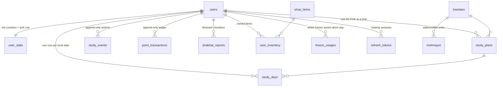

# Mishnah Tracker — Backend Design

FastAPI + SQLAlchemy 2.0 + PostgreSQL. Daily Mishnah study tracker with streaks,
multipliers, and a Shabbat mode that assumes the user is off-device from Friday
afternoon to Saturday night.

---

## 1. The three problems worth designing around

Most of this app is CRUD. Three things are not, and the whole structure follows
from them.

**A "day" is not a timestamp range.** It is a human unit that depends on the
user's timezone, on a 03:00 rollover (people learn at 01:00 and expect it to
count for the day that just ended), and on the Hebrew calendar. Every day
boundary goes through `UserClock`; no other module calls `.date()` on a
timestamp.

**Nobody is online when the penalty should fire.** A streak breaks at midnight
in a timezone the server isn't in, for a user who isn't connected. So the
system cannot be event-driven off user actions. Instead there is one
**idempotent settlement function** that walks a user's closed days and finalises
each exactly once — called on every read *and* from an hourly cron. Neither
needs to know about the other.

**Shabbat inverts the penalty logic.** For 28 hours a week, *not* using the app
is the expected behaviour and must cost nothing. That means the freeze is not a
UI state — it has to be a rule inside the settlement engine, or the cron will
happily punish observant users at 03:00 Saturday.

---

## 2. Schema



### The tables that carry the logic

| Table | Role | Why it exists separately |
|---|---|---|
| `study_days` | One row per user per local date, with a `status` | The **ledger of judgements**. "Was Tuesday missed?" is a stored fact, not a recomputation. Unique `(user_id, local_date)` is what makes settlement idempotent. |
| `study_events` | Append-only log of the user actually logging study | A day is a *judgement*; an event is an *action*. Two logs of 1 mishnah = two events, one day row. Carries the client `Idempotency-Key`. |
| `point_transactions` | Append-only, signed, with a unique `idempotency_key` | The truth about points. `user_stats.total_points` is a materialised balance you can always rebuild with `SUM(amount)`. |
| `user_stats` | Balance, streak, `last_settled_date` | Also the **lock row**: every mutating path takes `SELECT … FOR UPDATE` on it first, which serialises all scoring for that user without a distributed lock. |
| `shabbat_reports` | The Motzash declaration | Hands out points for days with no in-app activity, so it needs its own audit trail and its own timestamp (the Motash bonus depends on when it arrived). |

### Day statuses

| Status | Streak effect | Points | Meaning |
|---|---|---|---|
| `PENDING` | — | — | Open; today, or a day not yet settled |
| `COMPLETED` | +1 | award | Goal met |
| `MISSED` | → 0 | penalty | Goal not met, no protection |
| `FROZEN_ITEM` | unchanged | 0 | A Streak Freeze absorbed it |
| `SHABBAT_PENDING` | — | — | Fri/Sat awaiting the Motzash report |
| `SHABBAT_UNREPORTED` | unchanged | 0 | Grace expired — neutral, **not** punished |
| `EXEMPT` | unchanged | 0 | Before signup / paused plan |

The distinction between "unchanged" and "→ 0" is the entire Shabbat feature.
A freeze and an unreported Shabbat both *hold* the streak; neither *advances*
it. A freeze protects, it does not substitute for study.

### Progress as a single integer

`mishnayot.ordinal` is a 1-based running index within a tractate, so
`study_plans.current_ordinal` answers "where am I" with an integer compare
instead of `(chapter, number)` tuple logic. Advancing 2 mishnayot is `+= 2`,
even across a chapter boundary.

---

## 3. Scoring (`services/scoring.py` — pure, no I/O)

```
points = base_points × multiplier(streak_after_this_day)
```

| Streak | Multiplier | Points/day |
|---|---|---|
| 1–3 | 1.0× | 10 |
| 4–9 | 1.5× | **15** |
| 10–29 | 2.0× | 20 |
| 30+ | 2.5× | 25 |

Tiers are data, not an `if` chain — adding a 100-day tier is a config edit.
`streak_after` means the streak *including* today, so completing your 4th
consecutive day pays 15. Verified in `tests/test_rules.py`:
`[10, 10, 10, 15, 15]`.

**Penalty:** −15 and streak → 0, *clamped so the balance never goes below zero*.
A user returning after a month should find a discouraging zero, not a debt that
locks them out of the shop. The ledger records the amount actually applied.

**Streak Freeze:** 120 points, max 3 held. Consumed automatically by the
settlement engine when a day would otherwise be `MISSED` — no pre-arming, no
"you forgot to activate it" support tickets.

---

## 4. Sabbath Mode

### The week

```
Fri 00:00 ─ Double Portion unlocks. Friday's row requires 2 × daily_goal.
Fri 17:00 ─ freeze_start = candle lighting − 60 min.
            Penalties stop accruing. An unfinished Thursday is NOT judged;
            settlement defers rather than punishing.
Fri 18:00 ─ candle lighting.
Sat 20:00 ─ havdalah (tzeis). Report window opens.
Sat 23:59 ─ Motash bonus deadline (real local midnight, not the 03:00 rollover).
Mon 03:00 ─ report window closes. Unreported Fri/Sat lock as neutral.
```

### The quota is moved, not duplicated

Friday requires `2 × daily_goal`; Shabbat requires `0`. Over a week the user
still learns `daily_goal × 7` — asserted in
`test_the_weekly_quota_is_unchanged_by_shabbat_mode`.

### Four paths through a Shabbat

| What the user does | Friday | Shabbat | Streak | Points |
|---|---|---|---|---|
| Logs the double portion Friday morning | `COMPLETED` | `COMPLETED` | **+2** | 2 days' worth |
| Never opens the app, checks the box Motzash | `COMPLETED` | `COMPLETED` | **+2** | 2 days + Motash bonus |
| Checks the box Sunday | `COMPLETED` | `COMPLETED` | **+2** | 2 days, no bonus |
| Never reports | `SHABBAT_UNREPORTED` | `SHABBAT_UNREPORTED` | **held** | 0, no penalty |

Row 1 is a deliberate product decision: logging Friday's double portion *is*
doing Shabbat's quota, so Shabbat credits without the checkbox. The checkbox
remains the only route to the Motash bonus. Flip it in `_decide_shabbat` if you
want the declaration to be mandatory.

Friday is always credited **before** Shabbat, because the second day scores at
whatever tier the first one just unlocked. Getting that order wrong silently
underpays users at every tier boundary.

### Zmanim

`services/zmanim.py` is an interface with two implementations: real
sunset-based times via the `zmanim` package (KosherJava port), and a fixed
local-clock fallback (Fri 18:00 → Sat 20:00) for when the library is missing or
the user never shared a location. Yom Tov comes from `pyluach`, excluding Chol
HaMoed — verified against Rosh Hashana 5787 and Pesach 5786.

> **Verify before launch.** Check the library provider against a published luach
> for your target cities. Being 20 minutes late with a freeze is a support
> ticket; being 20 minutes early is a halachic complaint. The fallback provider
> is a stopgap, not a default for observant users.

---

## 5. Settlement — the one function that moves the economy

`services/settlement.py :: settle_user(session, user, now)`

```
lock user_stats FOR UPDATE
cursor = last_settled_date + 1
while cursor < today:                 # today is never finalised — it is still winnable
    day = get_or_create(cursor)
    decide → CREDIT | MISS | FREEZE | NEUTRAL | EXEMPT | CARRY | DEFER
    DEFER  → stop; leave the watermark behind this day
    else   → apply, advance last_settled_date
ensure today's row exists
```

Three properties make this safe to call from anywhere:

1. **Idempotent.** Terminal statuses are never recomputed, and every award
   carries a deterministic `idempotency_key` (`daily:<user>:<date>`). Re-running
   changes nothing. `ON CONFLICT DO NOTHING` returning `None` means "already
   applied" — the balance must not move, and the streak must not advance.
2. **Ordered.** Days resolve chronologically because the multiplier depends on
   the streak, which depends on yesterday.
3. **Deferring, not guessing.** `DEFER` is returned when a day is not yet
   judgeable — inside the Shabbat window, or before the report deadline. The
   watermark stays behind it, so the day is revisited later. This is what makes
   "penalties pause on Friday afternoon" a data-integrity property rather than a
   UI trick.

**Called on every read**, so a user opening the app after two weeks sees correct
state immediately. The **hourly** cron (`workers/nightly.py` — hourly despite
the name, because rollovers are per-timezone) exists only so lapsed users still
get penalties recorded and leaderboards aren't stale.

### Concurrency

Everything serialises behind the `user_stats` row lock, taken first and in the
same order by every mutating path. Two simultaneous "log study" requests cannot
both read `streak=3` and both write `streak=4`. Belt-and-braces on top:
`uq_user_day`, `uq_freeze_per_day`, and the unique `idempotency_key` on both the
ledger and `study_events`.

---

## 6. Auth

Google **Authorization Code + PKCE**. The code is exchanged server-side so the
client secret never reaches the browser, and the returned `id_token` is
*verified* against Google's JWKS (`aud`, `iss`, `exp`) rather than trusted — an
attacker can POST any JWT they like at our endpoint.

Users are keyed on Google's `sub`, **never on email**. Workspace emails get
reassigned; matching on them is an account-takeover vector.

We then issue our own short-lived access JWT (15 min) plus a rotating refresh
token stored **hashed** — a database leak must not hand out live sessions.
Reusing a consumed refresh token is the classic stolen-token signal, so it
revokes the whole chain for that user.

---

## 7. API

| Method | Path | Notes |
|---|---|---|
| `POST` | `/auth/google` | code + PKCE verifier → token pair |
| `POST` | `/auth/refresh` | single-use rotation |
| `PUT` | `/me/preferences` | timezone, location, `observes_shabbat` |
| `GET` | `/tractates` | onboarding picker |
| `POST` | `/plans` | tractate + daily goal → **estimated completion date** |
| `GET` | `/study/today` | home screen; settles first |
| `POST` | `/study/log` | `Idempotency-Key` header |
| `POST` | `/study/shabbat-report` | the Motzash checkbox |
| `GET` | `/study/history` | streak heatmap |
| `GET`/`POST` | `/shop/items`, `/shop/purchase` | Streak Freeze |
| `GET` | `/me/transactions` | points audit trail for the user |

Handlers are thin: validate, call one service, serialise. No business rule lives
in the HTTP layer, which is why the rules are testable without an app.

---

## 8. Completion estimate

A calendar **walk**, not `ceil(remaining / goal)` — division gets Shabbat wrong,
since Friday carries double and Shabbat carries none. Walking also makes
per-user rest days a one-line change later.

One subtlety the tests pinned down: if the final units come out of Friday's
*Shabbat* half, the siyum belongs on Shabbat, not Friday. If they come out of
Friday's own half, it stays Friday.

---

## 9. Status

```bash
python -m pytest tests/ -q
```

- **25 passing** — `tests/test_rules.py`, pure business rules (multiplier
  curve, penalty clamping, day boundaries across timezones, double-portion
  quota, freeze window containment, report deadline, completion estimates). No
  database needed.
- **15 skipped** — `tests/test_settlement.py`, the engine's acceptance criteria.
  These need PostgreSQL (`ON CONFLICT`, `FOR UPDATE`, partial indexes, JSONB —
  SQLite emulates none of it) and **have not been executed yet**. Run them first
  when you stand up a database.

Verified during development: the models import and emit correct PostgreSQL DDL,
including both partial indexes (`WHERE status = 'active'`,
`WHERE status IN ('pending','shabbat_pending')`).

### Not built yet

- Alembic migrations (models are the source; `alembic revision --autogenerate`)
- Tractate/mishnayot seed data — 63 tractates, ~4,200 rows, from Sefaria
- Achievement *rules* (tables and the hook exist; no engine)
- Yom Tov double-portion flow — Yom Tov currently never penalises and never
  credits without a log, mirroring an unreported Shabbat. The full
  Erev-Yom-Tov-carries-the-portion treatment reuses `_decide_shabbat`.
- Push notifications ("your streak ends in 3 hours" — must respect the freeze
  window, or you will text observant users on Shabbat)

### Decisions worth a second opinion

1. **Friday's double portion auto-credits Shabbat** (§4). Alternative: always
   require the checkbox.
2. **Report grace of 1 day.** Longer is kinder; too long and the "Motzash"
   ritual loses meaning.
3. **Penalty clamped at zero.** Alternative: allow debt.
4. **03:00 rollover.** Assumes nobody studies 03:00–06:00 and calls it
   yesterday.
